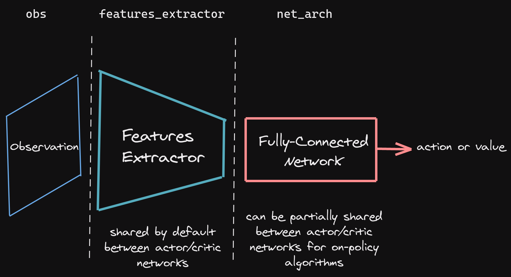
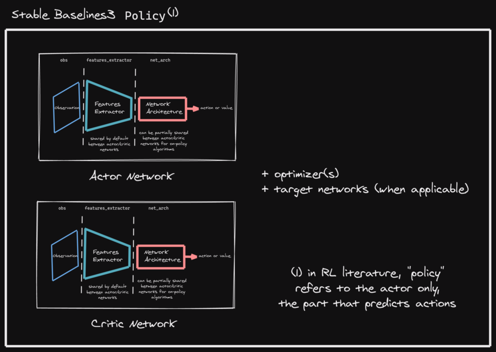

.. _custom_policy:

Custom Policy Network
=====================

Stable Baselines3 provides policy networks for images (CnnPolicies),
other type of input features (MlpPolicies) and multiple different inputs (MultiInputPolicies).

.. warning::
  For A2C and PPO, continuous actions are clipped during training and testing
  (to avoid out of bound error). SAC, DDPG and TD3 squash the action, using a ``tanh()`` transformation,
  which handles bounds more correctly.

SB3 Policy
^^^^^^^^^^

SB3 networks are separated into two mains parts (see figure below):

- A features extractor (usually shared between actor and critic when applicable, to save computation)
  whose role is to extract features (i.e. convert to a feature vector) from high-dimensional observations, for instance, a CNN that extracts features from images.
  This is the ``features_extractor_class`` parameter. You can change the default parameters of that features extractor
  by passing a ``features_extractor_kwargs`` parameter.

- A (fully-connected) network that maps the features to actions/value. Its architecture is controlled by the ``net_arch`` parameter.

.. note::

    All observations are first pre-processed (e.g. images are normalized, discrete obs are converted to one-hot vectors, ...) before being fed to the features extractor.
    In the case of vector observations, the features extractor is just a ``Flatten`` layer.

SB3 policies are usually composed of several networks (actor/critic networks + target networks when applicable) together
with the associated optimizers.

Each of these network have a features extractor followed by a fully-connected network.

.. note::

  When we refer to "policy" in Stable-Baselines3, this is usually an abuse of language compared to RL terminology.
  In SB3, "policy" refers to the class that handles all the networks useful for training,
  so not only the network used to predict actions (the "learned controller").

.. .. figure:: https://cdn-images-1.medium.com/max/960/1*h4WTQNVIsvMXJTCpXm_TAw.gif

Custom Network Architecture
^^^^^^^^^^^^^^^^^^^^^^^^^^^

One way of customising the policy network architecture is to pass arguments when creating the model,
using ``policy_kwargs`` parameter:

.. code-block:: python

  import gym
  import torch as th

  from stable_baselines3 import PPO

  # Custom actor (pi) and value function (vf) networks
  # of two layers of size 32 each with Relu activation function
  policy_kwargs = dict(activation_fn=th.nn.ReLU,
                       net_arch=[dict(pi=[32, 32], vf=[32, 32])])
  # Create the agent
  model = PPO("MlpPolicy", "CartPole-v1", policy_kwargs=policy_kwargs, verbose=1)
  # Retrieve the environment
  env = model.get_env()
  # Train the agent
  model.learn(total_timesteps=100000)
  # Save the agent
  model.save("ppo_cartpole")

  del model
  # the policy_kwargs are automatically loaded
  model = PPO.load("ppo_cartpole", env=env)

Custom Feature Extractor
^^^^^^^^^^^^^^^^^^^^^^^^

If you want to have a custom feature extractor (e.g. custom CNN when using images), you can define class
that derives from ``BaseFeaturesExtractor`` and then pass it to the model when training.

.. note::

  By default the feature extractor is shared between the actor and the critic to save computation (when applicable).
  However, this can be changed by defining a custom policy for on-policy algorithms
  (see `issue #1066 <https://github.com/DLR-RM/stable-baselines3/issues/1066#issuecomment-1246866844>`_
  for more information) or setting ``share_features_extractor=False`` in the
  ``policy_kwargs`` for off-policy algorithms (and when applicable).

.. code-block:: python

  import gym
  import torch as th
  import torch.nn as nn

  from stable_baselines3 import PPO
  from stable_baselines3.common.torch_layers import BaseFeaturesExtractor

  class CustomCNN(BaseFeaturesExtractor):
      """
      :param observation_space: (gym.Space)
      :param features_dim: (int) Number of features extracted.
          This corresponds to the number of unit for the last layer.
      """

      def __init__(self, observation_space: gym.spaces.Box, features_dim: int = 256):
          super(CustomCNN, self).__init__(observation_space, features_dim)
          # We assume CxHxW images (channels first)
          # Re-ordering will be done by pre-preprocessing or wrapper
          n_input_channels = observation_space.shape[0]
          self.cnn = nn.Sequential(
              nn.Conv2d(n_input_channels, 32, kernel_size=8, stride=4, padding=0),
              nn.ReLU(),
              nn.Conv2d(32, 64, kernel_size=4, stride=2, padding=0),
              nn.ReLU(),
              nn.Flatten(),
          )

          # Compute shape by doing one forward pass
          with th.no_grad():
              n_flatten = self.cnn(
                  th.as_tensor(observation_space.sample()[None]).float()
              ).shape[1]

          self.linear = nn.Sequential(nn.Linear(n_flatten, features_dim), nn.ReLU())

      def forward(self, observations: th.Tensor) -> th.Tensor:
          return self.linear(self.cnn(observations))

  policy_kwargs = dict(
      features_extractor_class=CustomCNN,
      features_extractor_kwargs=dict(features_dim=128),
  )
  model = PPO("CnnPolicy", "BreakoutNoFrameskip-v4", policy_kwargs=policy_kwargs, verbose=1)
  model.learn(1000)

Multiple Inputs and Dictionary Observations
^^^^^^^^^^^^^^^^^^^^^^^^^^^^^^^^^^^^^^^^^^^

Stable Baselines3 supports handling of multiple inputs by using ``Dict`` Gym space. This can be done using
``MultiInputPolicy``, which by default uses the ``CombinedExtractor`` feature extractor to turn multiple
inputs into a single vector, handled by the ``net_arch`` network.

By default, ``CombinedExtractor`` processes multiple inputs as follows:

1. If input is an image (automatically detected, see ``common.preprocessing.is_image_space``), process image with Nature Atari CNN network and
   output a latent vector of size ``256``.
2. If input is not an image, flatten it (no layers).
3. Concatenate all previous vectors into one long vector and pass it to policy.

Much like above, you can define custom feature extractors. The following example assumes the environment has two keys in the
observation space dictionary: "image" is a (1,H,W) image (channel first), and "vector" is a (D,) dimensional vector. We process "image" with a simple
downsampling and "vector" with a single linear layer.

.. code-block:: python

  import gym
  import torch as th
  from torch import nn

  from stable_baselines3.common.torch_layers import BaseFeaturesExtractor

  class CustomCombinedExtractor(BaseFeaturesExtractor):
      def __init__(self, observation_space: gym.spaces.Dict):
          # We do not know features-dim here before going over all the items,
          # so put something dummy for now. PyTorch requires calling
          # nn.Module.__init__ before adding modules
          super(CustomCombinedExtractor, self).__init__(observation_space, features_dim=1)

          extractors = {}

          total_concat_size = 0
          # We need to know size of the output of this extractor,
          # so go over all the spaces and compute output feature sizes
          for key, subspace in observation_space.spaces.items():
              if key == "image":
                  # We will just downsample one channel of the image by 4x4 and flatten.
                  # Assume the image is single-channel (subspace.shape[0] == 0)
                  extractors[key] = nn.Sequential(nn.MaxPool2d(4), nn.Flatten())
                  total_concat_size += subspace.shape[1] // 4 * subspace.shape[2] // 4
              elif key == "vector":
                  # Run through a simple MLP
                  extractors[key] = nn.Linear(subspace.shape[0], 16)
                  total_concat_size += 16

          self.extractors = nn.ModuleDict(extractors)

          # Update the features dim manually
          self._features_dim = total_concat_size

      def forward(self, observations) -> th.Tensor:
          encoded_tensor_list = []

          # self.extractors contain nn.Modules that do all the processing.
          for key, extractor in self.extractors.items():
              encoded_tensor_list.append(extractor(observations[key]))
          # Return a (B, self._features_dim) PyTorch tensor, where B is batch dimension.
          return th.cat(encoded_tensor_list, dim=1)

On-Policy Algorithms
^^^^^^^^^^^^^^^^^^^^

Shared Networks
---------------

The ``net_arch`` parameter of ``A2C`` and ``PPO`` policies allows to specify the amount and size of the hidden layers and how many
of them are shared between the policy network and the value network. It is assumed to be a list with the following
structure:

1. An arbitrary length (zero allowed) number of integers each specifying the number of units in a shared layer.
   If the number of ints is zero, there will be no shared layers.
2. An optional dict, to specify the following non-shared layers for the value network and the policy network.
   It is formatted like ``dict(vf=[<value layer sizes>], pi=[<policy layer sizes>])``.
   If it is missing any of the keys (pi or vf), no non-shared layers (empty list) is assumed.

In short: ``[<shared layers>, dict(vf=[<non-shared value network layers>], pi=[<non-shared policy network layers>])]``.

Examples
~~~~~~~~

Two shared layers of size 128: ``net_arch=[128, 128]``

.. code-block:: none

                  obs
                   |
                 <128>
                   |
                 <128>
           /               \
        action            value

Value network deeper than policy network, first layer shared: ``net_arch=[128, dict(vf=[256, 256])]``

.. code-block:: none

                  obs
                   |
                 <128>
           /               \
        action             <256>
                             |
                           <256>
                             |
                           value

Initially shared then diverging: ``[128, dict(vf=[256], pi=[16])]``

.. code-block:: none

                  obs
                   |
                 <128>
           /               \
         <16>             <256>
           |                |
        action            value

Advanced Example
~~~~~~~~~~~~~~~~

If your task requires even more granular control over the policy/value architecture, you can redefine the policy directly:

.. code-block:: python

  from typing import Callable, Dict, List, Optional, Tuple, Type, Union

  import gym
  import torch as th
  from torch import nn

  from stable_baselines3 import PPO
  from stable_baselines3.common.policies import ActorCriticPolicy

  class CustomNetwork(nn.Module):
      """
      Custom network for policy and value function.
      It receives as input the features extracted by the feature extractor.

      :param feature_dim: dimension of the features extracted with the features_extractor (e.g. features from a CNN)
      :param last_layer_dim_pi: (int) number of units for the last layer of the policy network
      :param last_layer_dim_vf: (int) number of units for the last layer of the value network
      """

      def __init__(
          self,
          feature_dim: int,
          last_layer_dim_pi: int = 64,
          last_layer_dim_vf: int = 64,
      ):
          super(CustomNetwork, self).__init__()

          # IMPORTANT:
          # Save output dimensions, used to create the distributions
          self.latent_dim_pi = last_layer_dim_pi
          self.latent_dim_vf = last_layer_dim_vf

          # Policy network
          self.policy_net = nn.Sequential(
              nn.Linear(feature_dim, last_layer_dim_pi), nn.ReLU()
          )
          # Value network
          self.value_net = nn.Sequential(
              nn.Linear(feature_dim, last_layer_dim_vf), nn.ReLU()
          )

      def forward(self, features: th.Tensor) -> Tuple[th.Tensor, th.Tensor]:
          """
          :return: (th.Tensor, th.Tensor) latent_policy, latent_value of the specified network.
              If all layers are shared, then ``latent_policy == latent_value``
          """
          return self.policy_net(features), self.value_net(features)
          
      def forward_actor(self, features: th.Tensor) -> th.Tensor:
          return self.policy_net(features)
      
      def forward_critic(self, features: th.Tensor) -> th.Tensor:
          return self.value_net(features)

  class CustomActorCriticPolicy(ActorCriticPolicy):
      def __init__(
          self,
          observation_space: gym.spaces.Space,
          action_space: gym.spaces.Space,
          lr_schedule: Callable[[float], float],
          net_arch: Optional[List[Union[int, Dict[str, List[int]]]]] = None,
          activation_fn: Type[nn.Module] = nn.Tanh,
          *args,
          **kwargs,
      ):

          super(CustomActorCriticPolicy, self).__init__(
              observation_space,
              action_space,
              lr_schedule,
              net_arch,
              activation_fn,
              # Pass remaining arguments to base class
              *args,
              **kwargs,
          )
          # Disable orthogonal initialization
          self.ortho_init = False

      def _build_mlp_extractor(self) -> None:
          self.mlp_extractor = CustomNetwork(self.features_dim)

  model = PPO(CustomActorCriticPolicy, "CartPole-v1", verbose=1)
  model.learn(5000)

Off-Policy Algorithms
^^^^^^^^^^^^^^^^^^^^^

If you need a network architecture that is different for the actor and the critic when using ``SAC``, ``DDPG`` or ``TD3``,
you can pass a dictionary of the following structure: ``dict(qf=[<critic network architecture>], pi=[<actor network architecture>])``.

For example, if you want a different architecture for the actor (aka ``pi``) and the critic (Q-function aka ``qf``) networks,
then you can specify ``net_arch=dict(qf=[400, 300], pi=[64, 64])``.

Otherwise, to have actor and critic that share the same network architecture,
you only need to specify ``net_arch=[256, 256]`` (here, two hidden layers of 256 units each).

.. note::
    Compared to their on-policy counterparts, no shared layers (other than the feature extractor)
    between the actor and the critic are allowed (to prevent issues with target networks).

.. note::
    For advanced customization of off-policy algorithms policies, please take a look at the code.
    A good understanding of the algorithm used is required, see discussion in `issue #425 <https://github.com/DLR-RM/stable-baselines3/issues/425>`_

.. code-block:: python

  from stable_baselines3 import SAC

  # Custom actor architecture with two layers of 64 units each
  # Custom critic architecture with two layers of 400 and 300 units
  policy_kwargs = dict(net_arch=dict(pi=[64, 64], qf=[400, 300]))
  # Create the agent
  model = SAC("MlpPolicy", "Pendulum-v1", policy_kwargs=policy_kwargs, verbose=1)
  model.learn(5000)
