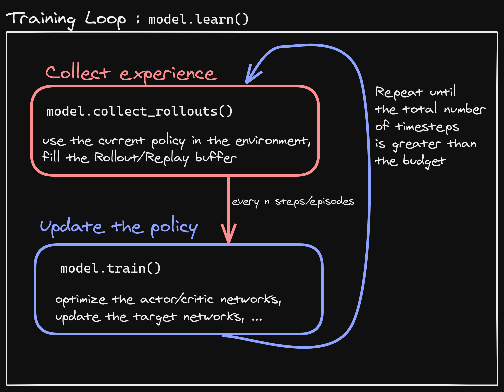

.. _developer:

================
Developer Guide
================

This guide is meant for those who want to understand the internals and the design choices of Stable-Baselines3.

At first, you should read the two issues where the design choices were discussed:

- https://github.com/hill-a/stable-baselines/issues/576
- https://github.com/hill-a/stable-baselines/issues/733

The library is not meant to be modular, although inheritance is used to reduce code duplication.

Algorithms Structure
====================

Each algorithm (on-policy and off-policy ones) follows a common structure.
Policy contains code for acting in the environment, and algorithm updates this policy.
There is one folder per algorithm, and in that folder there is the algorithm and the policy definition (``policies.py``).

Each algorithm has two main methods:

- ``.collect_rollouts()`` which defines how new samples are collected, usually inherited from the base class. Those samples are then stored in a ``RolloutBuffer`` (discarded after the gradient update) or ``ReplayBuffer``

- ``.train()`` which updates the parameters using samples from the buffer

Where to start?
===============

The first thing you need to read and understand are the base classes in the ``common/`` folder:

- ``BaseAlgorithm`` in ``base_class.py`` which defines how an RL class should look like.
  It contains also all the "glue code" for saving/loading and the common operations (wrapping environments)

- ``BasePolicy`` in ``policies.py`` which defines how a policy class should look like.
  It contains also all the magic for the ``.predict()`` method, to handle as many spaces/cases as possible

- ``OffPolicyAlgorithm`` in ``off_policy_algorithm.py`` that contains the implementation of ``collect_rollouts()`` for the off-policy algorithms,
  and similarly ``OnPolicyAlgorithm`` in ``on_policy_algorithm.py``.

All the environments handled internally are assumed to be ``VecEnv`` (``gym.Env`` are automatically wrapped).

Pre-Processing
==============

To handle different observation spaces, some pre-processing needs to be done (e.g. one-hot encoding for discrete observation).
Most of the code for pre-processing is in ``common/preprocessing.py`` and ``common/policies.py``.

For images, environment is automatically wrapped with ``VecTransposeImage`` if observations are detected to be images with
channel-last convention to transform it to PyTorch's channel-first convention.

Policy Structure
================

When we refer to "policy" in Stable-Baselines3, this is usually an abuse of language compared to RL terminology.
In SB3, "policy" refers to the class that handles all the networks useful for training,
so not only the network used to predict actions (the "learned controller").
For instance, the ``TD3`` policy contains the actor, the critic and the target networks.

To avoid the hassle of importing specific policy classes for specific algorithm (e.g. both A2C and PPO use ``ActorCriticPolicy``),
SB3 uses names like "MlpPolicy" and "CnnPolicy" to refer policies using small feed-forward networks or convolutional networks,
respectively. Importing ``[algorithm]/policies.py`` registers an appropriate policy for that algorithm under those names.

Probability distributions
=========================

When needed, the policies handle the different probability distributions.
All distributions are located in ``common/distributions.py`` and follow the same interface.
Each distribution corresponds to a type of action space (e.g. ``Categorical`` is the one used for discrete actions.
For continuous actions, we can use multiple distributions ("DiagGaussian", "SquashedGaussian" or "StateDependentDistribution")

State-Dependent Exploration
===========================

State-Dependent Exploration (SDE) is a type of exploration that allows to use RL directly on real robots,
that was the starting point for the Stable-Baselines3 library.
I (@araffin) published a paper about a generalized version of SDE (the one implemented in SB3): https://arxiv.org/abs/2005.05719

Misc
====

The rest of the ``common/`` is composed of helpers (e.g. evaluation helpers) or basic components (like the callbacks).
The ``type_aliases.py`` file contains common type hint aliases like ``GymStepReturn``.

Et voilà?

After reading this guide and the mentioned files, you should be now able to understand the design logic behind the library ;)
