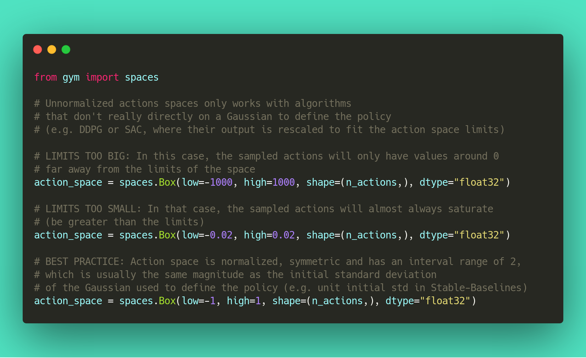

.. _rl_tips:

======================================
Reinforcement Learning Tips and Tricks
======================================

The aim of this section is to help you doing reinforcement learning experiments.
It covers general advice about RL (where to start, which algorithm to choose, how to evaluate an algorithm, ...),
as well as tips and tricks when using a custom environment or implementing an RL algorithm.

.. note::

  We have a `video on YouTube <https://www.youtube.com/watch?v=Ikngt0_DXJg>`_ that covers
  this section in more details. You can also find the `slides here <https://araffin.github.io/slides/rlvs-tips-tricks/>`_.

General advice when using Reinforcement Learning
================================================

TL;DR
-----

1. Read about RL and Stable Baselines3
2. Do quantitative experiments and hyperparameter tuning if needed
3. Evaluate the performance using a separate test environment (remember to check wrappers!)
4. For better performance, increase the training budget

Like any other subject, if you want to work with RL, you should first read about it (we have a dedicated `resource page <rl.html>`_ to get you started)
to understand what you are using. We also recommend you read Stable Baselines3 (SB3) documentation and do the `tutorial <https://github.com/araffin/rl-tutorial-jnrr19/tree/sb3>`_.
It covers basic usage and guide you towards more advanced concepts of the library (e.g. callbacks and wrappers).

Reinforcement Learning differs from other machine learning methods in several ways. The data used to train the agent is collected
through interactions with the environment by the agent itself (compared to supervised learning where you have a fixed dataset for instance).
This dependence can lead to vicious circle: if the agent collects poor quality data (e.g., trajectories with no rewards), then it will not improve and continue to amass
bad trajectories.

This factor, among others, explains that results in RL may vary from one run to another (i.e., when only the seed of the pseudo-random generator changes).
For this reason, you should always do several runs to have quantitative results.

Good results in RL are generally dependent on finding appropriate hyperparameters. Recent algorithms (PPO, SAC, TD3) normally require little hyperparameter tuning,
however, *don't expect the default ones to work* on any environment.

Therefore, we *highly recommend you* to take a look at the `RL zoo <https://github.com/DLR-RM/rl-baselines3-zoo>`_ (or the original papers) for tuned hyperparameters.
A best practice when you apply RL to a new problem is to do automatic hyperparameter optimization. Again, this is included in the `RL zoo <https://github.com/DLR-RM/rl-baselines3-zoo>`_.

When applying RL to a custom problem, you should always normalize the input to the agent (e.g. using VecNormalize for PPO/A2C)
and look at common preprocessing done on other environments (e.g. for `Atari <https://danieltakeshi.github.io/2016/11/25/frame-skipping-and-preprocessing-for-deep-q-networks-on-atari-2600-games/>`_, frame-stack, ...).
Please refer to *Tips and Tricks when creating a custom environment* paragraph below for more advice related to custom environments.

Current Limitations of RL
-------------------------

You have to be aware of the current `limitations <https://www.alexirpan.com/2018/02/14/rl-hard.html>`_ of reinforcement learning.

Model-free RL algorithms (i.e. all the algorithms implemented in SB) are usually *sample inefficient*. They require a lot of samples (sometimes millions of interactions) to learn something useful.
That's why most of the successes in RL were achieved on games or in simulation only. For instance, in this `work <https://www.youtube.com/watch?v=aTDkYFZFWug>`_ by ETH Zurich, the ANYmal robot was trained in simulation only, and then tested in the real world.

As a general advice, to obtain better performances, you should augment the budget of the agent (number of training timesteps).

In order to achieve the desired behavior, expert knowledge is often required to design an adequate reward function.
This *reward engineering* (or *RewArt* as coined by `Freek Stulp <http://www.freekstulp.net/>`_), necessitates several iterations. As a good example of reward shaping,
you can take a look at `Deep Mimic paper <https://xbpeng.github.io/projects/DeepMimic/index.html>`_ which combines imitation learning and reinforcement learning to do acrobatic moves.

One last limitation of RL is the instability of training. That is to say, you can observe during training a huge drop in performance.
This behavior is particularly present in ``DDPG``, that's why its extension ``TD3`` tries to tackle that issue.
Other method, like ``TRPO`` or ``PPO`` make use of a *trust region* to minimize that problem by avoiding too large update.

How to evaluate an RL algorithm?
--------------------------------

.. note::

  Pay attention to environment wrappers when evaluating your agent and comparing results to others' results. Modifications to episode rewards
  or lengths may also affect evaluation results which may not be desirable. Check ``evaluate_policy`` helper function in :ref:`Evaluation Helper <eval>` section.

Because most algorithms use exploration noise during training, you need a separate test environment to evaluate the performance
of your agent at a given time. It is recommended to periodically evaluate your agent for ``n`` test episodes (``n`` is usually between 5 and 20)
and average the reward per episode to have a good estimate.

.. note::

	We provide an ``EvalCallback`` for doing such evaluation. You can read more about it in the :ref:`Callbacks <callbacks>` section.

As some policy are stochastic by default (e.g. A2C or PPO), you should also try to set `deterministic=True` when calling the `.predict()` method,
this frequently leads to better performance.
Looking at the training curve (episode reward function of the timesteps) is a good proxy but underestimates the agent true performance.

We suggest you reading `Deep Reinforcement Learning that Matters <https://arxiv.org/abs/1709.06560>`_ for a good discussion about RL evaluation.

You can also take a look at this `blog post <https://openlab-flowers.inria.fr/t/how-many-random-seeds-should-i-use-statistical-power-analysis-in-deep-reinforcement-learning-experiments/457>`_
and this `issue <https://github.com/hill-a/stable-baselines/issues/199>`_ by Cédric Colas.

Which algorithm should I use?
=============================

There is no silver bullet in RL, depending on your needs and problem, you may choose one or the other.
The first distinction comes from your action space, i.e., do you have discrete (e.g. LEFT, RIGHT, ...)
or continuous actions (ex: go to a certain speed)?

Some algorithms are only tailored for one or the other domain: ``DQN`` only supports discrete actions, where ``SAC`` is restricted to continuous actions.

The second difference that will help you choose is whether you can parallelize your training or not.
If what matters is the wall clock training time, then you should lean towards ``A2C`` and its derivatives (PPO, ...).
Take a look at the `Vectorized Environments <vec_envs.html>`_ to learn more about training with multiple workers.

To sum it up:

Discrete Actions
----------------

.. note::

	This covers ``Discrete``, ``MultiDiscrete``, ``Binary`` and ``MultiBinary`` spaces

Discrete Actions - Single Process
^^^^^^^^^^^^^^^^^^^^^^^^^^^^^^^^^

``DQN`` with extensions (double DQN, prioritized replay, ...) are the recommended algorithms.
We notably provide ``QR-DQN`` in our :ref:`contrib repo <sb3_contrib>`.
``DQN`` is usually slower to train (regarding wall clock time) but is the most sample efficient (because of its replay buffer).

Discrete Actions - Multiprocessed
^^^^^^^^^^^^^^^^^^^^^^^^^^^^^^^^^

You should give a try to ``PPO`` or ``A2C``.

Continuous Actions
------------------

Continuous Actions - Single Process
^^^^^^^^^^^^^^^^^^^^^^^^^^^^^^^^^^^

Current State Of The Art (SOTA) algorithms are ``SAC``, ``TD3`` and ``TQC`` (available in our :ref:`contrib repo <sb3_contrib>`).
Please use the hyperparameters in the `RL zoo <https://github.com/DLR-RM/rl-baselines3-zoo>`_ for best results.

Continuous Actions - Multiprocessed
^^^^^^^^^^^^^^^^^^^^^^^^^^^^^^^^^^^

Take a look at ``PPO``, ``TRPO`` (available in our :ref:`contrib repo <sb3_contrib>`) or ``A2C``. Again, don't forget to take the hyperparameters from the `RL zoo <https://github.com/DLR-RM/rl-baselines3-zoo>`_
for continuous actions problems (cf *Bullet* envs).

.. note::

  Normalization is critical for those algorithms

Goal Environment
-----------------

If your environment follows the ``GoalEnv`` interface (cf :ref:`HER <her>`), then you should use
HER + (SAC/TD3/DDPG/DQN/QR-DQN/TQC) depending on the action space.

.. note::

	The ``batch_size`` is an important hyperparameter for experiments with :ref:`HER <her>`

Tips and Tricks when creating a custom environment
==================================================

If you want to learn about how to create a custom environment, we recommend you read this `page <custom_env.html>`_.
We also provide a `colab notebook <https://colab.research.google.com/github/araffin/rl-tutorial-jnrr19/blob/master/5_custom_gym_env.ipynb>`_ for
a concrete example of creating a custom gym environment.

Some basic advice:

- always normalize your observation space when you can, i.e., when you know the boundaries
- normalize your action space and make it symmetric when continuous (cf potential issue below) A good practice is to rescale your actions to lie in [-1, 1]. This does not limit you as you can easily rescale the action inside the environment
- start with shaped reward (i.e. informative reward) and simplified version of your problem
- debug with random actions to check that your environment works and follows the gym interface:

Two important things to keep in mind when creating a custom environment is to avoid breaking Markov assumption
and properly handle termination due to a timeout (maximum number of steps in an episode).
For instance, if there is some time delay between action and observation (e.g. due to wifi communication), you should give a history of observations
as input.

Termination due to timeout (max number of steps per episode) needs to be handled separately. You should fill the key in the info dict: ``info["TimeLimit.truncated"] = True``.
If you are using the gym ``TimeLimit`` wrapper, this will be done automatically.
You can read `Time Limit in RL <https://arxiv.org/abs/1712.00378>`_ or take a look at the `RL Tips and Tricks video <https://www.youtube.com/watch?v=Ikngt0_DXJg>`_
for more details.

We provide a helper to check that your environment runs without error:

.. code-block:: python

	from stable_baselines3.common.env_checker import check_env

	env = CustomEnv(arg1, ...)
	# It will check your custom environment and output additional warnings if needed
	check_env(env)

If you want to quickly try a random agent on your environment, you can also do:

.. code-block:: python

  env = YourEnv()
  obs = env.reset()
  n_steps = 10
  for _ in range(n_steps):
      # Random action
      action = env.action_space.sample()
      obs, reward, done, info = env.step(action)
      if done:
          obs = env.reset()

**Why should I normalize the action space?**

Most reinforcement learning algorithms rely on a Gaussian distribution (initially centered at 0 with std 1) for continuous actions.
So, if you forget to normalize the action space when using a custom environment,
this can harm learning and be difficult to debug (cf attached image and `issue #473 <https://github.com/hill-a/stable-baselines/issues/473>`_).

Another consequence of using a Gaussian is that the action range is not bounded.
That's why clipping is usually used as a bandage to stay in a valid interval.
A better solution would be to use a squashing function (cf ``SAC``) or a Beta distribution (cf `issue #112 <https://github.com/hill-a/stable-baselines/issues/112>`_).

.. note::

	This statement is not true for ``DDPG`` or ``TD3`` because they don't rely on any probability distribution.

Tips and Tricks when implementing an RL algorithm
=================================================

When you try to reproduce a RL paper by implementing the algorithm, the `nuts and bolts of RL research <http://joschu.net/docs/nuts-and-bolts.pdf>`_
by John Schulman are quite useful (`video <https://www.youtube.com/watch?v=8EcdaCk9KaQ>`_).

We *recommend following those steps to have a working RL algorithm*:

1. Read the original paper several times
2. Read existing implementations (if available)
3. Try to have some "sign of life" on toy problems
4. Validate the implementation by making it run on harder and harder envs (you can compare results against the RL zoo).
   You usually need to run hyperparameter optimization for that step.

You need to be particularly careful on the shape of the different objects you are manipulating (a broadcast mistake will fail silently cf. `issue #75 <https://github.com/hill-a/stable-baselines/pull/76>`_)
and when to stop the gradient propagation.

Don't forget to handle termination due to timeout separately (see remark in the custom environment section above),
you can also take a look at `Issue #284 <https://github.com/DLR-RM/stable-baselines3/issues/284>`_ and `Issue #633 <https://github.com/DLR-RM/stable-baselines3/issues/633>`_.

A personal pick (by @araffin) for environments with gradual difficulty in RL with continuous actions:

1. Pendulum (easy to solve)
2. HalfCheetahBullet (medium difficulty with local minima and shaped reward)
3. BipedalWalkerHardcore (if it works on that one, then you can have a cookie)

in RL with discrete actions:

1. CartPole-v1 (easy to be better than random agent, harder to achieve maximal performance)
2. LunarLander
3. Pong (one of the easiest Atari game)
4. other Atari games (e.g. Breakout)
