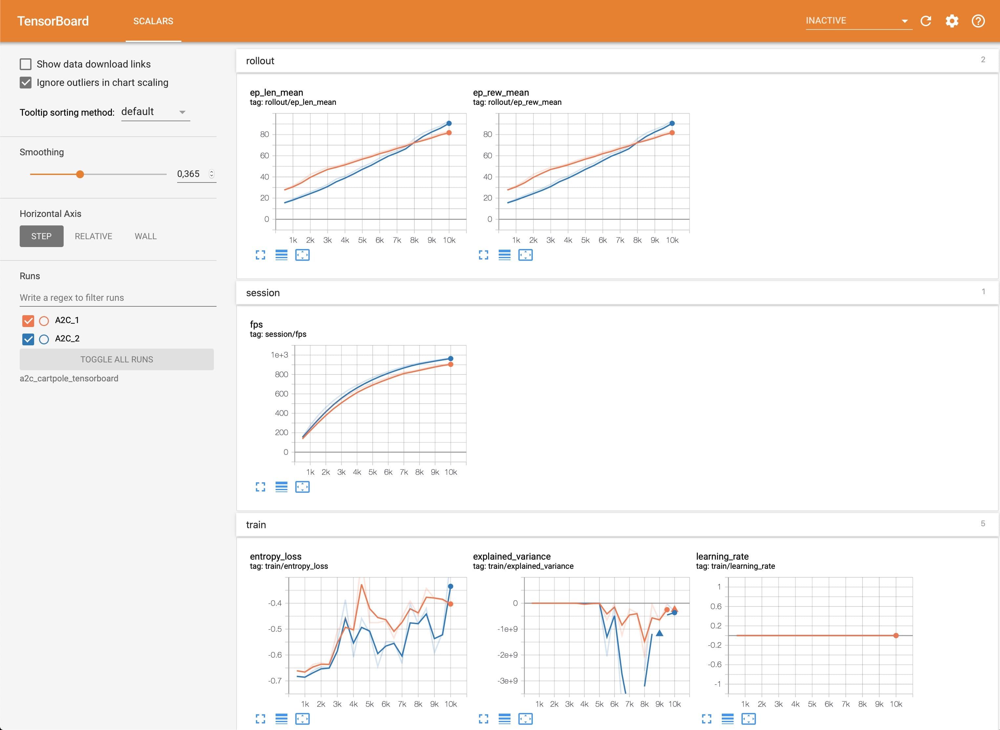

.. _tensorboard:

Tensorboard Integration
=======================

Basic Usage
------------

To use Tensorboard with stable baselines3, you simply need to pass the location of the log folder to the RL agent:

.. code-block:: python

    from stable_baselines3 import A2C

    model = A2C("MlpPolicy", "CartPole-v1", verbose=1, tensorboard_log="./a2c_cartpole_tensorboard/")
    model.learn(total_timesteps=10_000)

You can also define custom logging name when training (by default it is the algorithm name)

.. code-block:: python

    from stable_baselines3 import A2C

    model = A2C("MlpPolicy", "CartPole-v1", verbose=1, tensorboard_log="./a2c_cartpole_tensorboard/")
    model.learn(total_timesteps=10_000, tb_log_name="first_run")
    # Pass reset_num_timesteps=False to continue the training curve in tensorboard
    # By default, it will create a new curve
    # Keep tb_log_name constant to have continuous curve (see note below)
    model.learn(total_timesteps=10_000, tb_log_name="second_run", reset_num_timesteps=False)
    model.learn(total_timesteps=10_000, tb_log_name="third_run", reset_num_timesteps=False)

.. note::
    If you specify different ``tb_log_name`` in subsequent runs, you will have split graphs, like in the figure below.
    If you want them to be continuous, you must keep the same ``tb_log_name`` (see `issue #975 <https://github.com/DLR-RM/stable-baselines3/issues/975#issuecomment-1198992211>`_).
    And, if you still managed to get your graphs split by other means, just put tensorboard log files into the same folder.

    .. image:: ../_static/img/split_graph.png
      :width: 330
      :alt: split_graph

Once the learn function is called, you can monitor the RL agent during or after the training, with the following bash command:

.. code-block:: bash

  tensorboard --logdir ./a2c_cartpole_tensorboard/

.. note::

	You can find explanations about the logger output and names in the :ref:`Logger <logger>` section.

you can also add past logging folders:

.. code-block:: bash

  tensorboard --logdir ./a2c_cartpole_tensorboard/;./ppo2_cartpole_tensorboard/

It will display information such as the episode reward (when using a ``Monitor`` wrapper), the model losses and other parameter unique to some models.

Logging More Values
-------------------

Using a callback, you can easily log more values with TensorBoard.
Here is a simple example on how to log both additional tensor or arbitrary scalar value:

.. code-block:: python

    import numpy as np

    from stable_baselines3 import SAC
    from stable_baselines3.common.callbacks import BaseCallback

    model = SAC("MlpPolicy", "Pendulum-v1", tensorboard_log="/tmp/sac/", verbose=1)

    class TensorboardCallback(BaseCallback):
        """
        Custom callback for plotting additional values in tensorboard.
        """

        def __init__(self, verbose=0):
            super(TensorboardCallback, self).__init__(verbose)

        def _on_step(self) -> bool:
            # Log scalar value (here a random variable)
            value = np.random.random()
            self.logger.record("random_value", value)
            return True

    model.learn(50000, callback=TensorboardCallback())

.. note::

  If you want to log values more often than the default to tensorboard, you manually call ``self.logger.dump(self.num_timesteps)`` in a callback
  (see `issue #506 <https://github.com/DLR-RM/stable-baselines3/issues/506>`_).

Logging Images
--------------

TensorBoard supports periodic logging of image data, which helps evaluating agents at various stages during training.

.. warning::
    To support image logging `pillow <https://github.com/python-pillow/Pillow>`_ must be installed otherwise, TensorBoard ignores the image and logs a warning.

Here is an example of how to render an image to TensorBoard at regular intervals:

.. code-block:: python

    from stable_baselines3 import SAC
    from stable_baselines3.common.callbacks import BaseCallback
    from stable_baselines3.common.logger import Image

    model = SAC("MlpPolicy", "Pendulum-v1", tensorboard_log="/tmp/sac/", verbose=1)

    class ImageRecorderCallback(BaseCallback):
        def __init__(self, verbose=0):
            super(ImageRecorderCallback, self).__init__(verbose)

        def _on_step(self):
            image = self.training_env.render(mode="rgb_array")
            # "HWC" specify the dataformat of the image, here channel last
            # (H for height, W for width, C for channel)
            # See https://pytorch.org/docs/stable/tensorboard.html
            # for supported formats
            self.logger.record("trajectory/image", Image(image, "HWC"), exclude=("stdout", "log", "json", "csv"))
            return True

    model.learn(50000, callback=ImageRecorderCallback())

Logging Figures/Plots
---------------------
TensorBoard supports periodic logging of figures/plots created with matplotlib, which helps evaluating agents at various stages during training.

.. warning::
    To support figure logging `matplotlib <https://matplotlib.org/>`_ must be installed otherwise, TensorBoard ignores the figure and logs a warning.

Here is an example of how to store a plot in TensorBoard at regular intervals:

.. code-block:: python

    import numpy as np
    import matplotlib.pyplot as plt

    from stable_baselines3 import SAC
    from stable_baselines3.common.callbacks import BaseCallback
    from stable_baselines3.common.logger import Figure

    model = SAC("MlpPolicy", "Pendulum-v1", tensorboard_log="/tmp/sac/", verbose=1)

    class FigureRecorderCallback(BaseCallback):
        def __init__(self, verbose=0):
            super(FigureRecorderCallback, self).__init__(verbose)

        def _on_step(self):
            # Plot values (here a random variable)
            figure = plt.figure()
            figure.add_subplot().plot(np.random.random(3))
            # Close the figure after logging it
            self.logger.record("trajectory/figure", Figure(figure, close=True), exclude=("stdout", "log", "json", "csv"))
            plt.close()
            return True

    model.learn(50000, callback=FigureRecorderCallback())

Logging Videos
--------------

TensorBoard supports periodic logging of video data, which helps evaluating agents at various stages during training.

.. warning::
    To support video logging `moviepy <https://zulko.github.io/moviepy/>`_ must be installed otherwise, TensorBoard ignores the video and logs a warning.

Here is an example of how to render an episode and log the resulting video to TensorBoard at regular intervals:

.. code-block:: python

    from typing import Any, Dict

    import gym
    import torch as th

    from stable_baselines3 import A2C
    from stable_baselines3.common.callbacks import BaseCallback
    from stable_baselines3.common.evaluation import evaluate_policy
    from stable_baselines3.common.logger import Video

    class VideoRecorderCallback(BaseCallback):
        def __init__(self, eval_env: gym.Env, render_freq: int, n_eval_episodes: int = 1, deterministic: bool = True):
            """
            Records a video of an agent's trajectory traversing ``eval_env`` and logs it to TensorBoard

            :param eval_env: A gym environment from which the trajectory is recorded
            :param render_freq: Render the agent's trajectory every eval_freq call of the callback.
            :param n_eval_episodes: Number of episodes to render
            :param deterministic: Whether to use deterministic or stochastic policy
            """
            super().__init__()
            self._eval_env = eval_env
            self._render_freq = render_freq
            self._n_eval_episodes = n_eval_episodes
            self._deterministic = deterministic

        def _on_step(self) -> bool:
            if self.n_calls % self._render_freq == 0:
                screens = []

                def grab_screens(_locals: Dict[str, Any], _globals: Dict[str, Any]) -> None:
                    """
                    Renders the environment in its current state, recording the screen in the captured `screens` list

                    :param _locals: A dictionary containing all local variables of the callback's scope
                    :param _globals: A dictionary containing all global variables of the callback's scope
                    """
                    screen = self._eval_env.render(mode="rgb_array")
                    # PyTorch uses CxHxW vs HxWxC gym (and tensorflow) image convention
                    screens.append(screen.transpose(2, 0, 1))

                evaluate_policy(
                    self.model,
                    self._eval_env,
                    callback=grab_screens,
                    n_eval_episodes=self._n_eval_episodes,
                    deterministic=self._deterministic,
                )
                self.logger.record(
                    "trajectory/video",
                    Video(th.ByteTensor([screens]), fps=40),
                    exclude=("stdout", "log", "json", "csv"),
                )
            return True

    model = A2C("MlpPolicy", "CartPole-v1", tensorboard_log="runs/", verbose=1)
    video_recorder = VideoRecorderCallback(gym.make("CartPole-v1"), render_freq=5000)
    model.learn(total_timesteps=int(5e4), callback=video_recorder)

Logging Hyperparameters
-----------------------

TensorBoard supports logging of hyperparameters in its HPARAMS tab, which helps comparing agents trainings.

.. warning::
    To display hyperparameters in the HPARAMS section, a ``metric_dict`` must be given (as well as a ``hparam_dict``).

Here is an example of how to save hyperparameters in TensorBoard:

.. code-block:: python

    from stable_baselines3 import A2C
    from stable_baselines3.common.callbacks import BaseCallback
    from stable_baselines3.common.logger import HParam

    class HParamCallback(BaseCallback):
        def __init__(self):
            """
            Saves the hyperparameters and metrics at the start of the training, and logs them to TensorBoard.
            """
            super().__init__()

        def _on_training_start(self) -> None:
            hparam_dict = {
                "algorithm": self.model.__class__.__name__,
                "learning rate": self.model.learning_rate,
                "gamma": self.model.gamma,
            }
            # define the metrics that will appear in the `HPARAMS` Tensorboard tab by referencing their tag
            # Tensorbaord will find & display metrics from the `SCALARS` tab
            metric_dict = {
                "rollout/ep_len_mean": 0,
                "train/value_loss": 0,
            }
            self.logger.record(
                "hparams",
                HParam(hparam_dict, metric_dict),
                exclude=("stdout", "log", "json", "csv"),
            )

        def _on_step(self) -> bool:
            return True

    model = A2C("MlpPolicy", "CartPole-v1", tensorboard_log="runs/", verbose=1)
    model.learn(total_timesteps=int(5e4), callback=HParamCallback())

Directly Accessing The Summary Writer
-------------------------------------

If you would like to log arbitrary data (in one of the formats supported by `pytorch <https://pytorch.org/docs/stable/tensorboard.html>`_), you
can get direct access to the underlying SummaryWriter in a callback:

.. warning::
    This is method is not recommended and should only be used by advanced users.

.. code-block:: python

    from stable_baselines3 import SAC
    from stable_baselines3.common.callbacks import BaseCallback
    from stable_baselines3.common.logger import TensorBoardOutputFormat

    model = SAC("MlpPolicy", "Pendulum-v1", tensorboard_log="/tmp/sac/", verbose=1)

    class SummaryWriterCallback(BaseCallback):

        def _on_training_start(self):
            self._log_freq = 1000  # log every 1000 calls

            output_formats = self.logger.output_formats
            # Save reference to tensorboard formatter object
            # note: the failure case (not formatter found) is not handled here, should be done with try/except.
            self.tb_formatter = next(formatter for formatter in output_formats if isinstance(formatter, TensorBoardOutputFormat))

        def _on_step(self) -> bool:
            if self.n_calls % self._log_freq == 0:
                self.tb_formatter.writer.add_text("direct_access", "this is a value", self.num_timesteps)
                self.tb_formatter.writer.flush()

    model.learn(50000, callback=SummaryWriterCallback())
